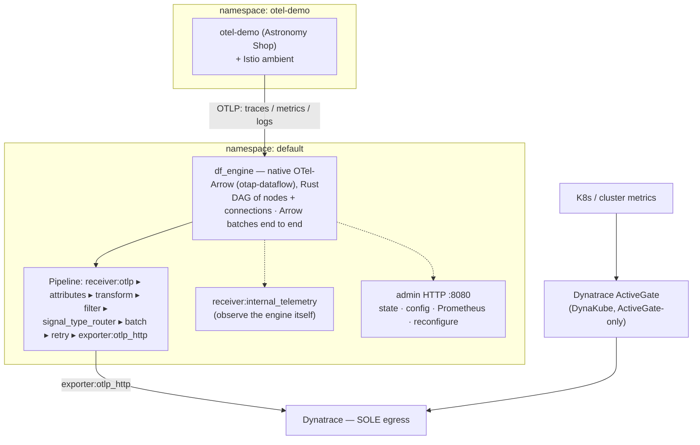

# Is it Observable

<p align="center"></p>

[](https://www.youtube.com/@Isitobservable)
[](https://github.com/open-telemetry/otel-arrow)
[](https://opentelemetry.io)
[](https://istio.io)
[](https://www.dynatrace.com)

> 📺 **Watch the episode:** https://www.youtube.com/@Isitobservable — *OTel-Arrow (OTAP) in Action*

---

## Episode : OTel-Arrow (OTAP) in Action

Build a telemetry pipeline on the **native OpenTelemetry-Arrow engine** — the new
**Rust** `otap-dataflow` runtime where Apache Arrow is the representation *end to end*,
not just the wire format. Collect logs, metrics and traces from a real microservices
app, run them through the engine's nodes, observe the engine itself, and send
everything to a single backend.

This repository accompanies the **Is It Observable** episode on OpenTelemetry-Arrow.
It gives you a reproducible, end-to-end stack on Kubernetes: the OpenTelemetry
Astronomy Shop demo, the native **`otap-dataflow` engine** running a real pipeline,
self-telemetry so you can watch the engine work, and a single Dynatrace egress.

**Components used in this episode:**

- **OTel-Arrow** `otap-dataflow` (`df_engine`) — the native **Rust**, Arrow-first engine (image `ghcr.io/isitobservable/df_engine`)
- **OpenTelemetry Operator** — manages the collectors used in the transport-reference and benchmark paths
- **Dynatrace Operator** (`kubernetes-monitoring` mode) — k8s entity enrichment + log/metric/trace ingest (the sole backend egress)
- **Istio** (ambient profile) — the service mesh carrying the OTel Demo
- **OpenTelemetry Demo** (Astronomy Shop) — the OTel-native microservices workload + load generator
- **cert-manager** — webhook CA prerequisite for the OTel Operator

Everything is destination **Dynatrace**, and the whole repo ships **no**
environment-specific values in git — every IP, tenant and token comes from your own
`KUBECONFIG` and Dynatrace secrets, so you can run all of it in *your* cluster.

---

## What you will learn

1. **What OTAP is and why it exists** — column-oriented (Apache Arrow) vs
   row-oriented (OTLP/protobuf), and where the efficiency comes from (thread-per-core,
   shared-nothing, Arrow batches with dictionary + delta compression, end to end).
2. **How to run the native Rust engine** — the `otap-dataflow` (`df_engine`) runtime,
   deployed from a **publicly pullable** image
   (`ghcr.io/isitobservable/df_engine`). Its pipeline is an explicit **DAG** of
   `nodes` + `connections`.
3. **A full pipeline covering (almost) every engine node** — ingest, enrich,
   transform, filter, route/fan-out, buffer and export. We exercise **every node the
   engine ships except the four designed for testing**. See
   [`deploy/df-engine/PLUGIN-COVERAGE.md`](./deploy/df-engine/PLUGIN-COVERAGE.md).
4. **How to observe OTel-Arrow itself** — the engine's `internal_telemetry` receiver
   and admin HTTP endpoint (state, config, Prometheus metrics, live reconfiguration).
5. **The honest scope** — the engine is **experimental** with a limited node set: **no
   filelog, no prometheus scrape, no k8sattributes, no tail sampling**. We build around
   what exists and say so. A GA **Go collector-contrib** path is included only as a
   clearly-labeled transport reference for the signals the engine can't yet source.

---

## Reference architecture



- **The pipeline is the native Rust engine.** One `otap` pipeline is multi-signal
  (logs+metrics+traces in one DAG). A second engine instance can receive over
  `receiver:otap` to demonstrate the **Arrow-native hop** between engines
  (`deploy/df-engine/pipelines/otap-hop.yaml`).
- **Single Dynatrace egress**: only the engine (app telemetry) and the DynaKube
  ActiveGate (cluster metrics) reach Dynatrace. Nothing else.
- **The engine image is published** at `ghcr.io/isitobservable/df_engine:0.50.0`
  (publicly pullable, no imagePullSecret) and already wired into the Deployment.
  Rebuild/bump via the repo's `build-df-engine.yml` workflow.
- **Go collector-contrib is a *transport reference only*** (`deploy/collectors/`),
  kept for the signals the engine can't yet source (pod-log `filelog`, `prometheus`
  scrape, `k8sattributes`). It is **not** the episode's pipeline.

---

## Prerequisites

- A Kubernetes cluster with a default StorageClass and a LoadBalancer. The tutorial
  uses **Istio ambient** for the demo's service mesh, but any recent cluster works;
  a CNI, a LoadBalancer (e.g. MetalLB on bare metal) and a storage driver are all
  you need.
- `kubectl` and `helm` v3.
- A **Dynatrace** tenant and two tokens:
  - an **operator token** (`apiToken`), and
  - a **data-ingest token** (`dataIngestToken`) with `metrics.ingest`,
    `logs.ingest` and `openTelemetryTrace.ingest` scopes.
- Command line access with `KUBECONFIG` pointing at your cluster.

> No Dynatrace? The pipeline is backend-agnostic. Point the gateway's
> `otlphttp/dynatrace` exporter at any OTLP/HTTP endpoint and drop the DynaKube.

---

## Provision a cluster (CAPI or GKE)

Don't have a cluster yet? [`cluster/`](./cluster/) ships two ready-to-use paths that
both end with a `KUBECONFIG` the rest of this repo points at. Pick whichever matches
your environment — full inputs and copy-paste steps are in
[`cluster/README.md`](./cluster/README.md).

**Option A — Cluster API (CAPI) on Proxmox** (self-hosted / on-prem / bare metal).
Provisions a 1 control-plane + 3-worker cluster on Proxmox VE via the CAPI Proxmox
provider (**CAPMOX**), with Cilium, Istio ambient, MetalLB and csi-driver-nfs delivered
as CAAPH add-ons — so the LoadBalancer and default StorageClass come for free:

```bash
# From a CAPI management cluster (clusterctl init --infrastructure proxmox --addon helm).
# Edit cluster/capi/values.env, then mirror into cluster.yaml + metallb.yaml.
kubectl apply -f cluster/capi/addons/metallb.yaml
kubectl apply -f cluster/capi/addons/csi-driver-nfs.yaml
kubectl apply -f cluster/capi/cluster.yaml
clusterctl describe cluster otel-arrow-demo        # watch it come up

clusterctl get kubeconfig otel-arrow-demo > otel-arrow-demo.kubeconfig
export KUBECONFIG=$PWD/otel-arrow-demo.kubeconfig
kubectl apply -f cluster/capi/metallb.yaml         # address pool
```

**Option B — GKE** (Google Cloud). Native LoadBalancer + `standard-rwo` StorageClass,
then install Istio ambient yourself:

```bash
gcloud container clusters create otel-arrow-demo \
  --region us-central1 --release-channel regular \
  --num-nodes 3 --machine-type e2-standard-4 --enable-ip-alias
gcloud container clusters get-credentials otel-arrow-demo --region us-central1

istioctl install --set profile=ambient --skip-confirmation
```

Either way you finish with `KUBECONFIG` pointing at a cluster that has a default
StorageClass and a LoadBalancer — continue with the stack below.

---

## Quick start

```bash
git clone https://github.com/isItObservable/Otel-arrow.git
cd Otel-arrow

# 0) provision a cluster if you don't have one — CAPI (Proxmox) or GKE.
#    See cluster/README.md. It ends with a KUBECONFIG:
export KUBECONFIG=~/.kube/otel-arrow-demo.kubeconfig
export DT_API_URL=https://<your-tenant>.live.dynatrace.com/api
export DT_OPERATOR_TOKEN=dt0c01....
export DT_INGEST_TOKEN=dt0c01....

# 1) supporting stack: cert-manager, operators, DynaKube (ActiveGate), otel-demo
./deploy/deploy.sh

# 2) deploy the native engine (image is prebuilt + publicly pullable) and point
#    otel-demo at it
kubectl apply -f deploy/df-engine/df-engine-configmap.yaml
kubectl apply -f deploy/df-engine/df-engine-deployment.yaml
```

Then follow [`TUTORIAL.md`](./TUTORIAL.md) to understand each step and to verify the
engine pipeline and its self-telemetry in Dynatrace.

---

## Observe OTel-Arrow itself (the self-telemetry pillar)

The engine watches itself two ways (see
[`deploy/df-engine/pipelines/host-and-self.yaml`](./deploy/df-engine/pipelines/host-and-self.yaml)):

- **`receiver:internal_telemetry`** — the engine's own pipeline metrics (throughput,
  per-node stats, Tokio runtime, channel saturation / backpressure) emitted as OTLP
  and shipped to Dynatrace like any other signal.
- **The admin HTTP endpoint** (`--http-admin-bind`, `:8080` here) — serves current
  pipeline state, the running config, debug logs, a **Prometheus** metrics page, and a
  **live-reconfiguration** API.

> ⚠️ **Metrics need a gateway collector for delta conversion.** Dynatrace — like most
> delta-native backends — rejects **cumulative** temporality on OTLP metric ingest, and
> the experimental `df_engine` has **no `cumulativetodelta` node**. So the engine's own
> Prometheus self-metrics (and any cumulative counters) must go through a **gateway
> OTel Collector** running the **`cumulativetodelta`** processor before egress. This repo
> ships exactly that: [`dashboards/df-engine-internal-metrics-collector.yaml`](./dashboards/df-engine-internal-metrics-collector.yaml)
> scrapes the engine's `:8080/metrics`, converts cumulative → delta, and forwards OTLP to
> Dynatrace; [`deploy/collectors/otel-gateway.yaml`](./deploy/collectors/otel-gateway.yaml)
> does the same for the app-signal path. **The same reminder is in
> [`TUTORIAL.md`](./TUTORIAL.md) Step 8** — if your metrics silently never arrive, this is
> almost always why.

For the transport efficiency numbers themselves (bytes-on-wire, compression ratio, the
CPU-for-bandwidth trade), see [`benchmark/README.md`](./benchmark/README.md)
and its number discipline (OTAP is ~2× vs OTLP+zstd typically; the "10×" headline is vs
*uncompressed*).

---

## Run the benchmark (each individual test)

The [`benchmark/`](./benchmark/) directory holds the **small benchmark**: three pipeline
*engines* shipping the same telemetry with the same feature set. Run **one variant at a
time** so the CPU/memory numbers are attributable, tear it down, then run the next
against the identical load:

```bash
# Variant B — OTel Collector (baseline)
kubectl apply -f benchmark/otel-collector/

# Variant C — Fluent Bit v5
kubectl apply -f benchmark/fluentbit-v5/

# Variant A — OTel-Arrow native (df_engine)
kubectl apply -f benchmark/otel-arrow/

# drive identical load, then read resource usage
kubectl apply -f benchmark/loadtest/
kubectl top pods -n default
```

Full per-test steps, what to measure, and the number discipline are in
[`benchmark/README.md`](./benchmark/README.md).

**📊 Our results** — from running this benchmark end to end
([`benchmark/RESULTS.md`](./benchmark/RESULTS.md)). Cost per engine at identical OTLP
load, **millicores per 1M spans** (lower is cheaper), integrity gate passed with **span
loss = 0**:

| Engine | CPU (mCores) | Memory | **mc / 1M spans** |
|--------|-------------:|-------:|------------------:|
| Fluent Bit v5 | 79.8 | 123.7 MiB | **5.87** |
| OTel Collector | 150.3 | 95.6 MiB | **10.40** |
| OTel-Arrow `df_engine` (OTLP in) | 162.6 | 157.9 MiB | **11.27** |
| OTel-Arrow `df_engine` (**OTAP hop**) | 9.66 | 35.9 MiB | **~0.72** |

At the leaf every engine ingests OTLP and the native Arrow engine costs a little more
per span — expected. The win shows up on the **Arrow-native (OTAP) hop**, where the
engine skips the row→columnar unpack and per-hop cost drops ~15×. See
[`benchmark/RESULTS.md`](./benchmark/RESULTS.md) for methodology and the number
discipline.

---

## Deploy the dashboard

A Dynatrace dashboard (dtctl-compatible YAML) to observe the engine's self-telemetry and
the benchmark lives in [`dashboards/`](./dashboards/):

```bash
# using dtctl (https://github.com/dynatrace-oss/dtctl)
dtctl apply --file dashboards/otel-arrow-dashboard.yaml
```

See [`dashboards/README.md`](./dashboards/README.md) for the tiles it ships and how to
import it from the Dynatrace UI as an alternative to `dtctl`.

---

## Scope & honesty

The `otap-dataflow` engine is **experimental** and ships a limited node set. We cover
**every node it has except the four designed for testing** (`traffic_generator`,
`noop`, `error`, `perf`) — full matrix in
[`PLUGIN-COVERAGE.md`](./deploy/df-engine/PLUGIN-COVERAGE.md). The honest gaps
to state on camera:

- **No `filelog` / pod-log receiver** — app logs arrive as OTLP; pod-log tailing needs
  an edge Go collector (`deploy/collectors/`).
- **No `prometheus` scrape receiver** — `host_metrics` covers node metrics; app metrics
  come over OTLP.
- **No `k8sattributes`** — static attributes only (asked upstream; still unimplemented).
- **No tail sampling** — only head-style `log_sampling`. The transform (OTTL) is
  experimental and minimal.

---

## Cleanup

```bash
helm uninstall otel-demo -n otel-demo
kubectl delete -f deploy/collectors/
kubectl delete -f deploy/dynatrace/dynakube.yaml
helm uninstall dynatrace-operator -n dynatrace
helm uninstall opentelemetry-operator -n opentelemetry-operator-system
helm uninstall cert-manager -n cert-manager
```

---

## Further reading

- OTel-Arrow project: <https://github.com/open-telemetry/otel-arrow>
- OTAP Phase-2 blog: <https://opentelemetry.io/blog/2025/otel-arrow-phase-2/>
- Go `otelarrow` receiver/exporter (GA, contrib):
  <https://github.com/open-telemetry/opentelemetry-collector-contrib/tree/main/receiver/otelarrowreceiver>
- Is It Observable: <https://www.youtube.com/@Isitobservable>
