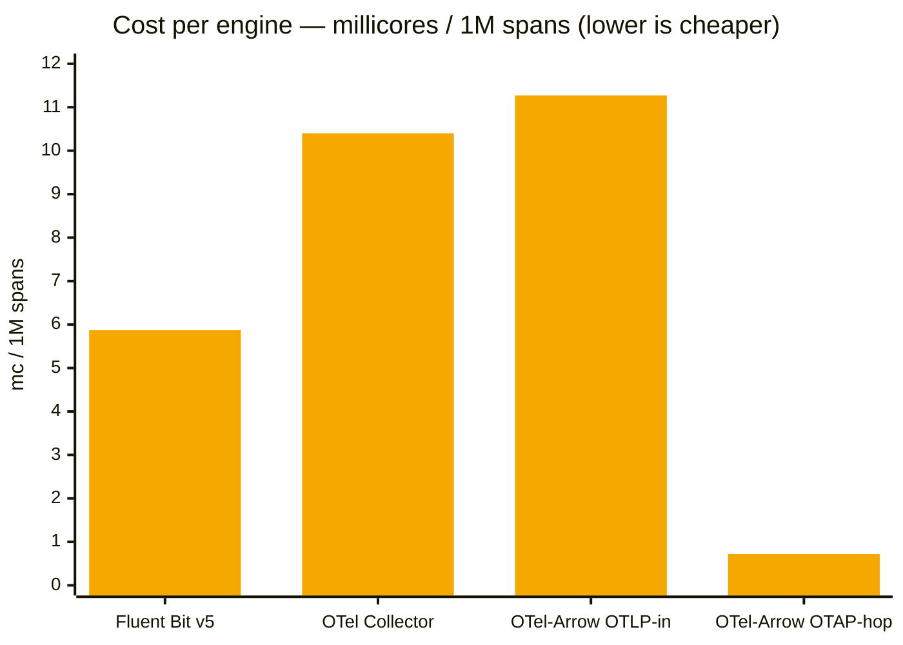
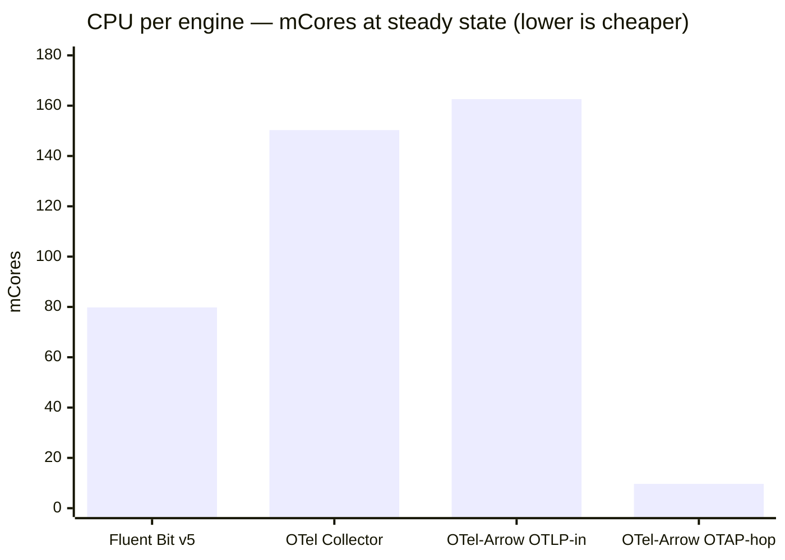
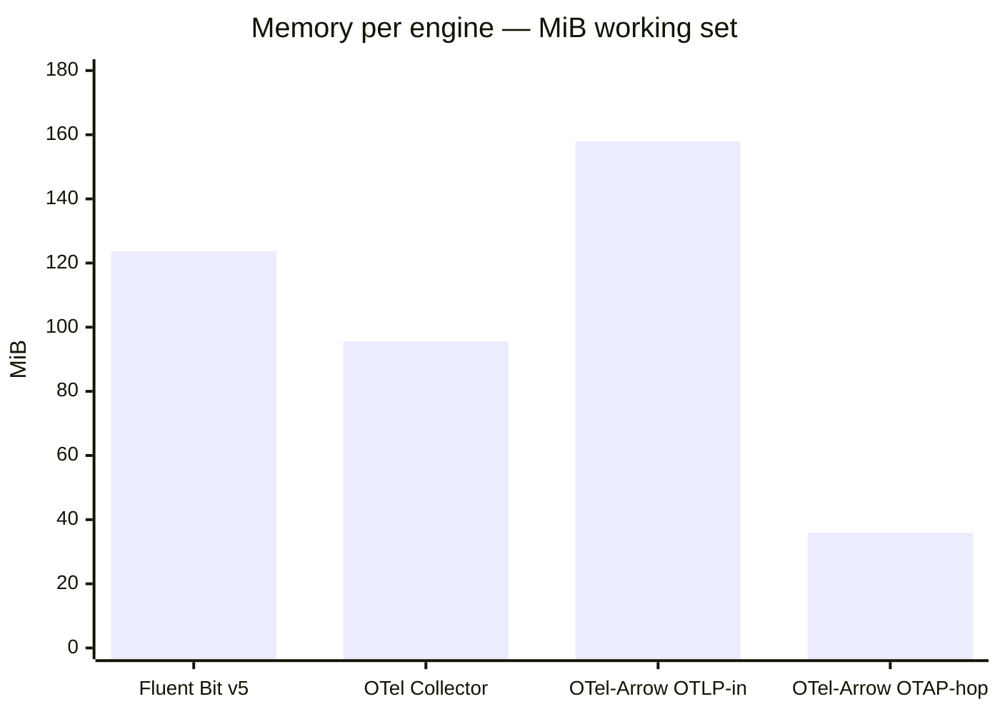
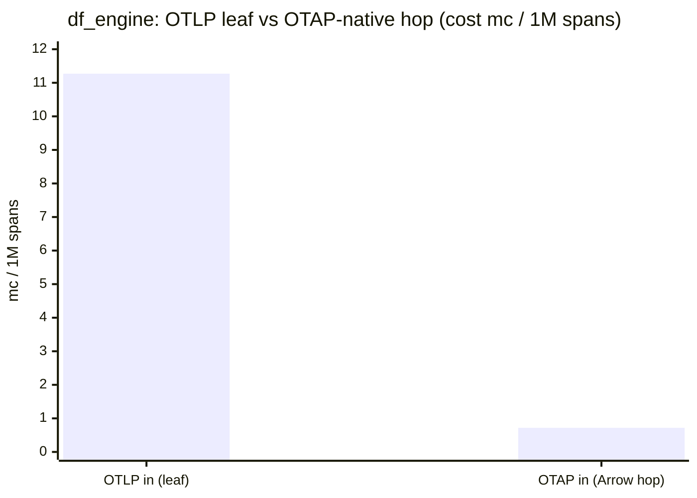
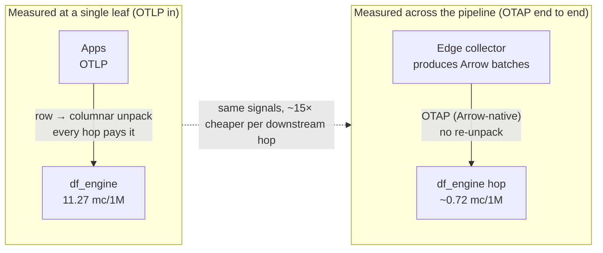
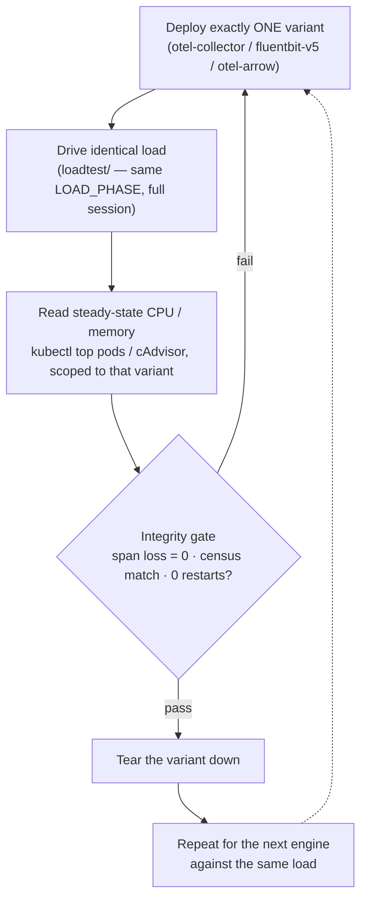

# Benchmark results — three engines, identical load

> A **dashboard on a page**. These are the numbers from our own runs of the
> [small benchmark](./README.md): the **same telemetry**, the **same feature set**
> (receive → parse → light-transform → batch → forward, **no tail sampling** in any
> variant), driven by the **same** load generator, with **one variant deployed at a time**
> so every CPU/memory figure is attributable to a single engine.
>
> Each run was a **120-minute** session at steady state. Cost is normalised as
> **millicores per 1,000,000 spans** (`mc/1M spans`) so the three engines are comparable
> regardless of how many spans each carried in its window. All three passed the same
> data-integrity gate: **span loss = 0**, census match, **0 pod restarts**.

---

## KPI tiles — at a glance

| | Fluent Bit v5 | OTel Collector | OTel-Arrow `df_engine` (OTLP in) | OTel-Arrow `df_engine` (**OTAP hop**) |
|---|:---:|:---:|:---:|:---:|
| **Cost** `mc / 1M spans` | **5.87** 🟢 | 10.40 | 11.27 | **~0.72** 🏆 |
| **CPU** `mCores` | 79.8 | 150.3 | 162.6 | **9.66** |
| **Memory** | 123.7 MiB | 95.6 MiB | 157.9 MiB | **35.9 MiB** |
| **Spans processed** | 13.58 M | 14.45 M | 14.43 M | — |
| **Span loss** | 0 ✅ | 0 ✅ | 0 ✅ | 0 ✅ |
| **Restarts** | 0 ✅ | 0 ✅ | 0 ✅ | 0 ✅ |
| **Language / model** | C, native | Go, OTLP in-mem | Rust, Arrow-first | Rust, Arrow-native |

---

## Cost per engine — `mc / 1M spans` (lower is cheaper)

**Read it honestly:** when every engine ingests **OTLP** and does the same light
transform, Fluent Bit v5 is the cheapest per span, the Go collector sits in the middle,
and the native Arrow engine costs a little more per span **at the leaf**. That is
expected — the win of OTel-Arrow is **not** cheaper OTLP ingest; it is the
**Arrow-native hop between engines** (last bar, and the section below).

---

## CPU and memory — the compute you actually pay

CPU and memory are shown **next to** the per-span cost, never hidden behind the bandwidth
story. At the OTLP leaf the Arrow engine is the most expensive on both axes — the honest
price of unpacking rows into Arrow columns at every hop.

---

## Where OTAP actually pays off — the Arrow-native hop

The interesting result is what happens when the engine receives an **already-Arrow
(OTAP)** stream instead of OTLP, so it never pays the row→columnar unpack at ingest. In
that configuration the `df_engine`'s own footprint collapses — an order-of-magnitude drop
on every axis:

| Configuration | df_engine CPU | df_engine Memory | **Cost (mc / 1M spans)** |
|---------------|--------------:|-----------------:|-------------------------:|
| OTLP in (leaf) | 162.6 mCores | 157.9 MiB | 11.27 |
| **OTAP in (Arrow-native hop)** | **9.66 mCores** | **35.9 MiB** | **~0.72** |

The receive/parse cost does not vanish — it **shifts to the edge** that produced the Arrow
batches. Where does the efficiency live? Speak OTAP **end to end** and every downstream
hop drops by an order of magnitude:

Measured at a single leaf, OTAP looks slightly more expensive; measured across the
**pipeline**, the columnar representation is where the efficiency lives.

---

## Number discipline (repeat the baseline every time)

- OTAP efficiency is **relative to a named baseline**: **~2× vs OTLP+zstd** (typical), up
  to **~8×** on multivariate metrics, **15–30× only vs *uncompressed* OTLP**. The famous
  **"10×"** is the vs-uncompressed headline — **never quote it bare**.
- The **CPU/memory cost is real** — every bandwidth saving is shown next to the compute it
  costs. The leaf tiles and bars above are exactly that: the honest per-engine price.

---

## How these were produced

1. Deploy exactly one variant (`benchmark/otel-collector/`, `benchmark/fluentbit-v5/`,
   or `benchmark/otel-arrow/`).
2. Drive the identical load (`benchmark/loadtest/`) for the full session — pick the phase
   (`stable30` / `rampup2h` / `leak24h`) described in [`README.md`](./README.md).
3. Read steady-state CPU/memory from `kubectl top pods` (metrics-server) / cAdvisor,
   scoped to that variant's agent + gateway pods only.
4. Confirm the integrity gate (span loss = 0, census match, 0 restarts), tear the variant
   down, and repeat for the next engine against the same load.

> Your absolute numbers will differ with node size and load; the **ordering** and the
> **order-of-magnitude OTAP-hop effect** are what reproduce. Re-run each variant back to
> back on the same cluster and compare *relative* cost, never a single cross-run figure.
